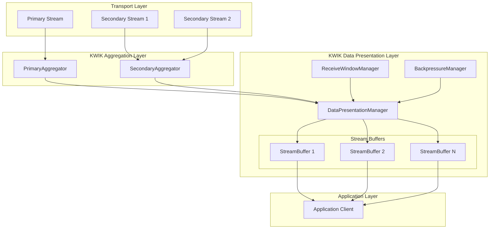

# Design Document

## Overview

Ce document décrit la conception d'un mécanisme robuste de présentation des flux de données applicatives agrégées dans KWIK. Le système actuel présente des défauts critiques : mélange des flux de données et absence de contrôle de la fenêtre de réception. Cette conception propose une architecture basée sur des buffers séparés par flux avec une fenêtre de réception limitée et un mécanisme de contre-pression.

## Architecture

### Vue d'ensemble du système



### Composants principaux

1. **DataPresentationManager** : Gestionnaire central qui coordonne la présentation des données
2. **StreamBuffer** : Buffer dédié pour chaque flux de données avec métadonnées
3. **ReceiveWindowManager** : Gestionnaire de la fenêtre de réception globale
4. **BackpressureManager** : Gestionnaire de la contre-pression par flux et globale

## Components and Interfaces

### DataPresentationManager

```go
type DataPresentationManager interface {
    // Gestion des flux
    CreateStreamBuffer(streamID uint64, metadata *StreamMetadata) error
    RemoveStreamBuffer(streamID uint64) error
    GetStreamBuffer(streamID uint64) (StreamBuffer, error)
    
    // Lecture des données
    ReadFromStream(streamID uint64, buffer []byte) (int, error)
    ReadFromStreamWithTimeout(streamID uint64, buffer []byte, timeout time.Duration) (int, error)
    
    // Gestion de la fenêtre de réception
    GetReceiveWindowStatus() *ReceiveWindowStatus
    SetReceiveWindowSize(size uint64) error
    
    // Contre-pression
    IsBackpressureActive(streamID uint64) bool
    GetBackpressureStatus() *BackpressureStatus
    
    // Statistiques et monitoring
    GetStreamStats(streamID uint64) *StreamStats
    GetGlobalStats() *GlobalPresentationStats
}
```

### StreamBuffer

```go
type StreamBuffer interface {
    // Écriture de données (depuis l'agrégateur)
    Write(data []byte, offset uint64) error
    WriteWithMetadata(data []byte, offset uint64, metadata *DataMetadata) error
    
    // Lecture de données (vers l'application)
    Read(buffer []byte) (int, error)
    ReadContiguous(buffer []byte) (int, error)
    
    // Gestion de la position de lecture
    GetReadPosition() uint64
    SetReadPosition(position uint64) error
    AdvanceReadPosition(bytes int) error
    
    // État du buffer
    GetAvailableBytes() int
    GetContiguousBytes() int
    HasGaps() bool
    GetNextGapPosition() (uint64, bool)
    
    // Métadonnées
    GetStreamMetadata() *StreamMetadata
    UpdateStreamMetadata(metadata *StreamMetadata) error
    
    // Contrôle de flux
    GetBufferUsage() *BufferUsage
    IsBackpressureNeeded() bool
    
    // Nettoyage
    Cleanup() error
    Close() error
}
```

### ReceiveWindowManager

```go
type ReceiveWindowManager interface {
    // Configuration de la fenêtre
    SetWindowSize(size uint64) error
    GetWindowSize() uint64
    GetAvailableWindow() uint64
    
    // Gestion de l'occupation
    AllocateWindow(streamID uint64, size uint64) error
    ReleaseWindow(streamID uint64, size uint64) error
    
    // Glissement de la fenêtre
    SlideWindow(bytesConsumed uint64) error
    
    // État de la fenêtre
    GetWindowStatus() *ReceiveWindowStatus
    IsWindowFull() bool
    GetWindowUtilization() float64
    
    // Notifications
    SetWindowFullCallback(callback func()) error
    SetWindowAvailableCallback(callback func()) error
}
```

### BackpressureManager

```go
type BackpressureManager interface {
    // Activation/désactivation de la contre-pression
    ActivateBackpressure(streamID uint64, reason BackpressureReason) error
    DeactivateBackpressure(streamID uint64) error
    
    // État de la contre-pression
    IsBackpressureActive(streamID uint64) bool
    GetBackpressureReason(streamID uint64) BackpressureReason
    
    // Contre-pression globale
    ActivateGlobalBackpressure(reason BackpressureReason) error
    DeactivateGlobalBackpressure() error
    IsGlobalBackpressureActive() bool
    
    // Notifications
    SetBackpressureCallback(callback BackpressureCallback) error
    
    // Métriques
    GetBackpressureStats() *BackpressureStats
}
```

## Data Models

### StreamMetadata

```go
type StreamMetadata struct {
    StreamID     uint64
    StreamType   StreamType
    Priority     StreamPriority
    MaxBufferSize uint64
    CreatedAt    time.Time
    LastActivity time.Time
    Properties   map[string]interface{}
}

type StreamType int
const (
    StreamTypeData StreamType = iota
    StreamTypeControl
    StreamTypeMetadata
)

type StreamPriority int
const (
    StreamPriorityLow StreamPriority = iota
    StreamPriorityNormal
    StreamPriorityHigh
    StreamPriorityCritical
)
```

### DataMetadata

```go
type DataMetadata struct {
    Offset      uint64
    Length      uint64
    Timestamp   time.Time
    SourcePath  string
    Checksum    uint32
    Flags       DataFlags
    Properties  map[string]interface{}
}

type DataFlags uint32
const (
    DataFlagNone        DataFlags = 0
    DataFlagEndOfStream DataFlags = 1 << 0
    DataFlagUrgent      DataFlags = 1 << 1
    DataFlagCompressed  DataFlags = 1 << 2
)
```

### ReceiveWindowStatus

```go
type ReceiveWindowStatus struct {
    TotalSize       uint64
    UsedSize        uint64
    AvailableSize   uint64
    Utilization     float64
    StreamAllocations map[uint64]uint64 // streamID -> allocated bytes
    IsBackpressureActive bool
    LastSlideTime   time.Time
}
```

### BufferUsage

```go
type BufferUsage struct {
    TotalCapacity    uint64
    UsedCapacity     uint64
    AvailableCapacity uint64
    ContiguousBytes  uint64
    GapCount         int
    LargestGapSize   uint64
    ReadPosition     uint64
    WritePosition    uint64
    Utilization      float64
}
```

### BackpressureStatus

```go
type BackpressureStatus struct {
    GlobalActive    bool
    GlobalReason    BackpressureReason
    StreamStatus    map[uint64]StreamBackpressureInfo
    ActiveStreams   int
    TotalStreams    int
    LastActivation  time.Time
}

type StreamBackpressureInfo struct {
    StreamID    uint64
    Active      bool
    Reason      BackpressureReason
    Duration    time.Duration
    ActivatedAt time.Time
}

type BackpressureReason int
const (
    BackpressureReasonNone BackpressureReason = iota
    BackpressureReasonWindowFull
    BackpressureReasonBufferFull
    BackpressureReasonSlowConsumer
    BackpressureReasonMemoryPressure
)
```

## Architecture détaillée

### Flux de données

1. **Réception des données agrégées**
   - Les données arrivent du SecondaryAggregator et du flux primaire
   - Le DataPresentationManager identifie le flux cible via les métadonnées
   - Les données sont routées vers le StreamBuffer approprié

2. **Stockage dans les StreamBuffers**
   - Chaque flux a son propre buffer avec gestion des offsets
   - Les données sont stockées à leur position correcte selon l'offset
   - Les gaps sont détectés et trackés pour la lecture contiguë

3. **Gestion de la fenêtre de réception**
   - Le ReceiveWindowManager surveille l'occupation totale
   - Allocation d'espace pour chaque nouveau flux
   - Glissement de la fenêtre lors de la consommation

4. **Lecture par l'application**
   - L'application lit flux par flux via des appels séparés
   - Seules les données contiguës sont retournées
   - La position de lecture avance automatiquement

### Mécanisme de contre-pression

1. **Détection des conditions de contre-pression**
   - Buffer de flux plein (seuil configurable)
   - Fenêtre de réception globale pleine
   - Consommateur lent détecté

2. **Activation de la contre-pression**
   - Notification aux producteurs (agrégateurs)
   - Ralentissement ou suspension de l'écriture
   - Métriques et logs pour le monitoring

3. **Désactivation automatique**
   - Libération d'espace buffer suffisant
   - Glissement de la fenêtre de réception
   - Reprise normale du flux de données

## Error Handling

### Stratégies de gestion d'erreurs

1. **Erreurs de buffer**
   - Buffer overflow : activation de la contre-pression
   - Corruption de données : isolation du flux et notification
   - Gaps persistants : timeout et signalement d'erreur

2. **Erreurs de fenêtre de réception**
   - Fenêtre pleine : contre-pression globale
   - Allocation impossible : rejet avec erreur explicite
   - Glissement impossible : nettoyage forcé

3. **Erreurs de lecture**
   - Données non contiguës : attente ou timeout
   - Flux fermé : retour de fin de flux
   - Timeout de lecture : erreur avec contexte

4. **Récupération automatique**
   - Nettoyage des buffers corrompus
   - Réallocation de la fenêtre de réception
   - Redémarrage des flux en erreur si possible

## Testing Strategy

### Tests unitaires

1. **StreamBuffer**
   - Test d'écriture avec offsets non séquentiels
   - Test de lecture contiguë avec gaps
   - Test de gestion de la position de lecture
   - Test de détection de contre-pression

2. **ReceiveWindowManager**
   - Test d'allocation et libération de fenêtre
   - Test de glissement de fenêtre
   - Test de détection de fenêtre pleine
   - Test de callbacks de notification

3. **BackpressureManager**
   - Test d'activation/désactivation par flux
   - Test de contre-pression globale
   - Test de notifications et callbacks
   - Test de métriques de contre-pression

4. **DataPresentationManager**
   - Test de création/suppression de flux
   - Test de routage des données
   - Test d'intégration avec la fenêtre de réception
   - Test de coordination de la contre-pression

### Tests d'intégration

1. **Scénarios multi-flux**
   - Écriture simultanée sur plusieurs flux
   - Lecture séparée de chaque flux
   - Gestion de la fenêtre partagée
   - Contre-pression sélective

2. **Scénarios de charge**
   - Producteur rapide, consommateur lent
   - Fenêtre de réception saturée
   - Récupération après contre-pression
   - Performance sous charge élevée

3. **Scénarios d'erreur**
   - Corruption de données dans un flux
   - Fermeture inattendue de flux
   - Épuisement de la fenêtre de réception
   - Récupération après erreurs

### Tests de performance

1. **Benchmarks de débit**
   - Débit par flux individuel
   - Débit agrégé multi-flux
   - Impact de la contre-pression
   - Comparaison avec l'implémentation actuelle

2. **Benchmarks de latence**
   - Latence de bout en bout
   - Latence de détection de contre-pression
   - Latence de récupération après erreur
   - Impact des gaps sur la latence

3. **Benchmarks mémoire**
   - Utilisation mémoire par flux
   - Efficacité de la fenêtre de réception
   - Fragmentation des buffers
   - Nettoyage et libération mémoire

## Configuration et optimisation

### Paramètres configurables

1. **Fenêtre de réception**
   - Taille totale (défaut : 4 Mo)
   - Seuil de contre-pression (défaut : 80%)
   - Taille de glissement (défaut : 64 Ko)

2. **Buffers de flux**
   - Taille maximale par flux (défaut : 1 Mo)
   - Seuil de contre-pression par flux (défaut : 75%)
   - Timeout de gap (défaut : 100ms)

3. **Performance**
   - Nombre de workers pour le traitement parallèle
   - Taille des batches de traitement
   - Intervalles de nettoyage automatique

### Optimisations

1. **Gestion mémoire**
   - Pools de buffers réutilisables
   - Allocation par blocs pour réduire la fragmentation
   - Nettoyage proactif des données consommées

2. **Traitement parallèle**
   - Workers dédiés par flux pour les opérations coûteuses
   - Traitement par batches des métadonnées
   - Pipeline de traitement asynchrone

3. **Algorithmes optimisés**
   - Détection rapide des gaps avec structures de données efficaces
   - Glissement de fenêtre optimisé avec copies minimales
   - Cache des positions de lecture fréquentes