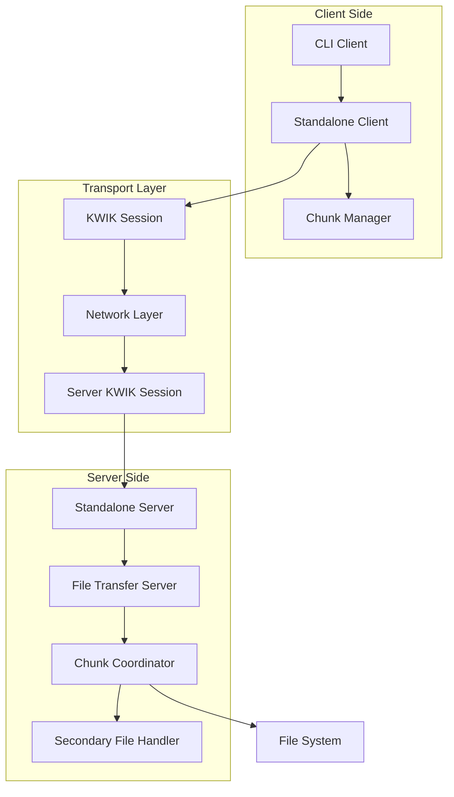

# Design Document

## Overview

Ce document présente la conception détaillée du serveur de transfert de fichiers et de la CLI basés sur le protocole KWIK. Le système s'appuie sur l'infrastructure existante de transfert de fichiers pour fournir une solution complète avec serveur autonome et client en ligne de commande.

L'architecture tire parti des composants existants :
- `filetransfer/standalone_server.go` et `filetransfer/standalone_client.go` comme base
- `filetransfer/server.go` et `filetransfer/client.go` pour la logique de transfert
- `filetransfer/chunk_coordinator.go` et `filetransfer/chunk_manager.go` pour la gestion des chunks
- `kwik/pkg/session/` pour le protocole de transport KWIK

## Architecture

### Architecture Globale



### Architecture des Composants

#### Serveur de Transfert de Fichiers

Le serveur est composé de plusieurs couches :

1. **Serveur Autonome** (`cmd/kwik-file-server/`)
   - Point d'entrée principal
   - Gestion de la configuration
   - Initialisation des composants

2. **Gestionnaire de Sessions** (`filetransfer/standalone_server.go`)
   - Gestion des connexions clients
   - Création des sessions KWIK
   - Coordination multi-chemin

3. **Serveur de Transfert** (`filetransfer/server.go`)
   - Traitement des demandes de fichiers
   - Validation des permissions
   - Gestion des métadonnées

4. **Coordinateur de Chunks** (`filetransfer/chunk_coordinator.go`)
   - Distribution des chunks entre chemins
   - Optimisation des performances
   - Gestion des échecs

#### Client CLI

Le client CLI est structuré comme suit :

1. **Interface CLI** (`cmd/kwik-file-client/`)
   - Parsing des arguments
   - Interface utilisateur
   - Gestion des signaux

2. **Client Autonome** (`filetransfer/standalone_client.go`)
   - Gestion de la connexion serveur
   - Coordination des téléchargements
   - Gestion des erreurs

3. **Gestionnaire de Chunks** (`filetransfer/chunk_manager.go`)
   - Réception et validation des chunks
   - Reconstruction des fichiers
   - Gestion de la reprise

## Components and Interfaces

### Interface du Serveur

```go
type FileTransferServer interface {
    Start() error
    Stop() error
    IsRunning() bool
    GetActiveClients() int
    GetServerStats() *ServerStatistics
}

type ServerConfig struct {
    Address           string
    FileDirectory     string
    SecondaryAddress  string
    MaxFileSize       int64
    AllowedExtensions []string
    MaxConcurrent     int
    ChunkSize         int32
}
```

### Interface du Client

```go
type FileTransferClient interface {
    Connect(serverAddress string) error
    DownloadFile(filename, outputPath string, options *DownloadOptions) error
    GetDownloadProgress(filename string) (*DownloadProgress, error)
    CancelDownload(filename string) error
    Disconnect() error
}

type DownloadOptions struct {
    ResumeTransfer    bool
    ProgressCallback  func(progress float64)
    MaxRetries        int
    ChunkTimeout      time.Duration
}
```

### Interface CLI

```go
type CLICommand interface {
    Execute(args []string) error
    GetUsage() string
    GetDescription() string
}

type DownloadCommand struct {
    ServerAddress string
    Filename      string
    OutputPath    string
    Resume        bool
    Verbose       bool
}
```

## Data Models

### Configuration du Serveur

```go
type ServerConfiguration struct {
    Server struct {
        Address          string `yaml:"address"`
        FileDirectory    string `yaml:"file_directory"`
        SecondaryAddress string `yaml:"secondary_address,omitempty"`
    } `yaml:"server"`
    
    Limits struct {
        MaxFileSize       int64    `yaml:"max_file_size"`
        MaxConcurrent     int      `yaml:"max_concurrent"`
        AllowedExtensions []string `yaml:"allowed_extensions,omitempty"`
    } `yaml:"limits"`
    
    Performance struct {
        ChunkSize         int32 `yaml:"chunk_size"`
        SecondaryPaths    []string `yaml:"secondary_paths,omitempty"`
    } `yaml:"performance"`
}
```

### État du Transfert

```go
type TransferState struct {
    Filename         string
    TotalSize        int64
    TransferredBytes int64
    StartTime        time.Time
    EstimatedTime    time.Duration
    Speed            float64
    Status           TransferStatus
    ErrorMessage     string
    ChunkProgress    map[uint32]ChunkState
}

type ChunkState struct {
    SequenceNum uint32
    Status      ChunkStatus
    RetryCount  int
    LastError   string
}
```

### Statistiques du Serveur

```go
type ServerStatistics struct {
    StartTime         time.Time
    ActiveClients     int
    TotalTransfers    int64
    CompletedTransfers int64
    FailedTransfers   int64
    TotalBytesServed  int64
    AverageSpeed      float64
    PathStatistics    map[string]*PathStats
}

type PathStats struct {
    PathID           string
    TotalChunks      int64
    SuccessfulChunks int64
    FailedChunks     int64
    AverageBandwidth float64
}
```

## Error Handling

### Hiérarchie des Erreurs

```go
type FileTransferError struct {
    Code    ErrorCode
    Message string
    Cause   error
}

type ErrorCode int

const (
    ErrConnectionFailed ErrorCode = iota
    ErrFileNotFound
    ErrPermissionDenied
    ErrFileTooLarge
    ErrInvalidExtension
    ErrTransferTimeout
    ErrChunkCorrupted
    ErrMaxRetriesExceeded
    ErrDiskFull
    ErrServerOverloaded
)
```

### Stratégies de Récupération

1. **Erreurs de Connexion**
   - Tentatives de reconnexion automatiques
   - Basculement vers chemins alternatifs
   - Sauvegarde de l'état pour reprise

2. **Erreurs de Chunks**
   - Retransmission automatique
   - Validation par checksum
   - Limitation du nombre de tentatives

3. **Erreurs de Fichiers**
   - Validation préalable des permissions
   - Vérification de l'espace disque
   - Messages d'erreur détaillés

## Testing Strategy

### Tests Unitaires

1. **Composants du Serveur**
   - Configuration et validation
   - Gestion des sessions clients
   - Coordination des chunks
   - Validation des fichiers

2. **Composants du Client**
   - Parsing des arguments CLI
   - Gestion des connexions
   - Reconstruction des fichiers
   - Interface utilisateur

3. **Utilitaires Communs**
   - Calcul des checksums
   - Gestion des erreurs
   - Sérialisation des données

### Tests d'Intégration

1. **Transferts Simples**
   - Transfert de fichiers de différentes tailles
   - Validation de l'intégrité
   - Gestion des erreurs

2. **Transferts Multi-Chemin**
   - Distribution des chunks
   - Basculement en cas d'échec
   - Optimisation des performances

3. **Scénarios de Reprise**
   - Interruption et reprise
   - Corruption de chunks
   - Panne de serveur

### Tests de Performance

1. **Benchmarks de Débit**
   - Transferts de gros fichiers
   - Comparaison mono vs multi-chemin
   - Impact de la taille des chunks

2. **Tests de Charge**
   - Clients multiples simultanés
   - Limitation des ressources
   - Dégradation gracieuse

3. **Tests de Latence**
   - Temps de réponse initial
   - Latence des chunks
   - Impact des retransmissions

## Security Considerations

### Authentification

- Utilisation du système d'authentification KWIK existant
- Validation des sessions clients
- Gestion des timeouts de session

### Autorisation

- Validation des chemins de fichiers (pas de traversée de répertoires)
- Restriction par extensions de fichiers
- Limitation de la taille des fichiers

### Intégrité des Données

- Checksums SHA256 pour tous les chunks
- Validation de l'intégrité globale des fichiers
- Détection et correction des corruptions

### Protection contre les Attaques

- Limitation du nombre de connexions simultanées
- Protection contre les attaques par déni de service
- Validation stricte des entrées utilisateur

## Performance Optimizations

### Optimisations Serveur

1. **Gestion des Chunks**
   - Distribution intelligente basée sur la bande passante
   - Cache des chunks fréquemment demandés
   - Parallélisation des lectures disque

2. **Gestion des Connexions**
   - Pool de connexions réutilisables
   - Limitation des ressources par client
   - Nettoyage automatique des sessions inactives

### Optimisations Client

1. **Gestion des Téléchargements**
   - Réception parallèle des chunks
   - Buffer circulaire pour l'écriture
   - Compression des données temporaires

2. **Interface Utilisateur**
   - Mise à jour asynchrone de la progression
   - Affichage optimisé des statistiques
   - Gestion efficace des signaux système

### Optimisations Réseau

1. **Protocole KWIK**
   - Utilisation optimale des chemins multiples
   - Adaptation dynamique à la qualité réseau
   - Gestion intelligente des retransmissions

2. **Gestion des Buffers**
   - Taille optimale des chunks
   - Buffers adaptatifs selon la bande passante
   - Minimisation des copies de données

## Deployment Architecture

### Structure des Binaires

```
kwik-file-transfer/
├── bin/
│   ├── kwik-file-server      # Serveur autonome
│   └── kwik-file-client      # Client CLI
├── config/
│   ├── server.yaml           # Configuration serveur
│   └── client.yaml           # Configuration client
├── data/                     # Répertoire de fichiers (serveur)
└── logs/                     # Fichiers de logs
```

### Configuration de Déploiement

1. **Serveur Principal**
   - Adresse publique accessible
   - Répertoire de fichiers sécurisé
   - Configuration des limites

2. **Serveur Secondaire** (optionnel)
   - Adresse alternative pour multi-chemin
   - Synchronisation des fichiers
   - Configuration de basculement

3. **Client**
   - Configuration des serveurs par défaut
   - Répertoire de téléchargement
   - Paramètres de performance

### Monitoring et Logs

1. **Métriques Serveur**
   - Nombre de clients actifs
   - Débit de transfert
   - Taux d'erreur

2. **Logs Détaillés**
   - Connexions clients
   - Transferts de fichiers
   - Erreurs et exceptions

3. **Alertes**
   - Surcharge serveur
   - Échecs de transfert répétés
   - Problèmes de connectivité