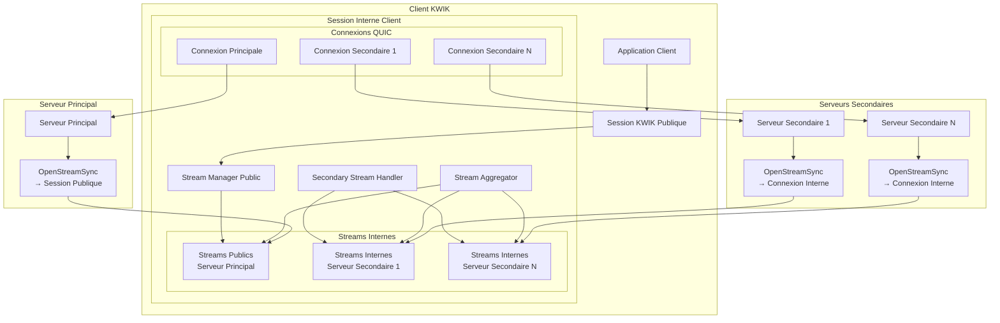

# Design Document - KWIK Secondary Stream Isolation

## Overview

Cette spécification définit la modification de l'architecture KWIK pour isoler les ouvertures de streams des serveurs secondaires. L'objectif est de restreindre les ouvertures de streams directs aux serveurs principaux uniquement, tout en permettant aux serveurs secondaires de contribuer aux données des streams KWIK via une agrégation interne transparente.

### Objectifs de Conception

- **Isolation des Streams** : Seul le serveur principal peut ouvrir des streams sur la session cliente publique
- **Agrégation Transparente** : Les données des serveurs secondaires sont agrégées en interne dans les streams KWIK appropriés
- **Compatibilité** : L'interface publique KWIK reste inchangée
- **Performance** : Maintenir les performances optimales malgré la complexité supplémentaire

## Architecture

### Vue d'Ensemble de l'Architecture Modifiée



### Composants Principaux

#### 1. Secondary Stream Handler
- **Responsabilité** : Gestion des streams ouverts par les serveurs secondaires
- **Isolation** : Maintient les streams secondaires séparés de la session publique
- **Communication** : Interface avec les connexions QUIC des serveurs secondaires

#### 2. Stream Aggregator
- **Responsabilité** : Agrégation des données des streams secondaires dans les streams KWIK
- **Mapping** : Maintient la correspondance entre streams secondaires et streams KWIK
- **Offset Management** : Gère les offsets pour positionner correctement les données

#### 3. Internal Stream Metadata Protocol
- **Responsabilité** : Protocole de communication interne pour identifier les streams cibles
- **Encapsulation** : Encapsule les métadonnées avec les données des streams secondaires

## Components and Interfaces

### Structure du Projet Modifiée

```
kwik/
├── pkg/
│   ├── stream/
│   │   ├── secondary_handler.go      # Nouveau: Gestion des streams secondaires
│   │   ├── aggregator.go            # Modifié: Agrégation des streams
│   │   ├── metadata_protocol.go     # Nouveau: Protocole de métadonnées
│   │   ├── isolation.go             # Modifié: Isolation des streams
│   │   └── mapping_manager.go       # Nouveau: Gestion des mappings
│   ├── session/
│   │   ├── client.go                # Modifié: Intégration du handler secondaire
│   │   └── server.go                # Modifié: Restriction des ouvertures
│   └── data/
│       ├── secondary_aggregator.go  # Nouveau: Agrégation spécialisée
│       └── offset_manager.go        # Modifié: Gestion des offsets multi-sources
├── proto/
│   ├── secondary_stream.proto       # Nouveau: Messages pour streams secondaires
│   └── stream_metadata.proto        # Nouveau: Métadonnées des streams
└── internal/
    └── stream/
        └── secondary_isolation.go   # Nouveau: Logique d'isolation
```

### Nouvelles Interfaces

#### Secondary Stream Handler Interface
```go
type SecondaryStreamHandler interface {
    // Gestion des streams secondaires
    HandleSecondaryStream(pathID string, stream quic.Stream) error
    CloseSecondaryStream(pathID string, streamID uint64) error
    
    // Mapping vers streams KWIK
    MapToKwikStream(secondaryStreamID uint64, kwikStreamID uint64, offset uint64) error
    UnmapSecondaryStream(secondaryStreamID uint64) error
    
    // Statistiques
    GetSecondaryStreamStats(pathID string) (*SecondaryStreamStats, error)
    GetActiveMappings() map[uint64]uint64 // secondaryStreamID -> kwikStreamID
}

type SecondaryStreamStats struct {
    ActiveStreams    int
    TotalDataBytes   uint64
    MappedStreams    int
    UnmappedStreams  int
    AggregationRatio float64
}
```

#### Stream Aggregator Interface (Étendue)
```go
type StreamAggregator interface {
    // Agrégation existante
    AggregateData(streamID uint64) ([]byte, error)
    
    // Nouvelles méthodes pour streams secondaires
    AggregateSecondaryData(kwikStreamID uint64, secondaryData *SecondaryStreamData) error
    SetStreamMapping(kwikStreamID uint64, secondaryStreamID uint64, pathID string) error
    RemoveStreamMapping(secondaryStreamID uint64) error
    
    // Gestion des offsets multi-sources
    ValidateOffset(kwikStreamID uint64, offset uint64, sourcePathID string) error
    GetNextExpectedOffset(kwikStreamID uint64) uint64
}

type SecondaryStreamData struct {
    StreamID     uint64
    PathID       string
    Data         []byte
    Offset       uint64
    KwikStreamID uint64
    Timestamp    time.Time
}
```

#### Metadata Protocol Interface
```go
type MetadataProtocol interface {
    // Encapsulation des métadonnées
    EncapsulateData(kwikStreamID uint64, offset uint64, data []byte) ([]byte, error)
    DecapsulateData(encapsulatedData []byte) (*StreamMetadata, []byte, error)
    
    // Validation des métadonnées
    ValidateMetadata(metadata *StreamMetadata) error
    CreateStreamOpenMetadata(kwikStreamID uint64) (*StreamMetadata, error)
}

type StreamMetadata struct {
    KwikStreamID uint64
    Offset       uint64
    DataLength   uint32
    Timestamp    uint64
    SourcePathID string
    MessageType  MetadataType
}

type MetadataType int

const (
    MetadataTypeData MetadataType = iota
    MetadataTypeStreamOpen
    MetadataTypeStreamClose
    MetadataTypeOffsetSync
)
```

### Interfaces Modifiées

#### Session Interface (Client)
```go
type ClientSession interface {
    // Méthodes existantes (inchangées)
    OpenStreamSync(ctx context.Context) (Stream, error)
    AcceptStream(ctx context.Context) (Stream, error)
    
    // Nouvelles méthodes internes (non exposées publiquement)
    getSecondaryStreamHandler() SecondaryStreamHandler
    getStreamAggregator() StreamAggregator
    handleSecondaryStreamOpen(pathID string, stream quic.Stream) error
}
```

#### Session Interface (Server)
```go
type ServerSession interface {
    // Méthodes existantes
    OpenStreamSync(ctx context.Context) (Stream, error) // Restreint au serveur principal
    AcceptStream(ctx context.Context) (Stream, error)
    
    // Nouvelles méthodes pour serveurs secondaires
    openSecondaryStream(ctx context.Context) (SecondaryStream, error)
    getServerRole() ServerRole // PRIMARY ou SECONDARY
}

type ServerRole int

const (
    ServerRolePrimary ServerRole = iota
    ServerRoleSecondary
)

type SecondaryStream interface {
    // Interface similaire à Stream mais pour usage interne
    Write([]byte) (int, error)
    Close() error
    GetKwikStreamID() uint64
    GetOffset() uint64
    SetKwikStreamMapping(kwikStreamID uint64, offset uint64) error
}
```

## Data Models

### Messages Protobuf pour Streams Secondaires

#### Messages de Métadonnées
```protobuf
// secondary_stream.proto
syntax = "proto3";
package kwik.secondary;

message SecondaryStreamOpen {
    uint64 secondary_stream_id = 1;
    uint64 target_kwik_stream_id = 2;
    uint64 initial_offset = 3;
    string source_path_id = 4;
    uint64 timestamp = 5;
}

message SecondaryStreamData {
    uint64 secondary_stream_id = 1;
    uint64 kwik_stream_id = 2;
    uint64 offset = 3;
    bytes data = 4;
    bool fin = 5;
    uint64 timestamp = 6;
    string source_path_id = 7;
}

message SecondaryStreamClose {
    uint64 secondary_stream_id = 1;
    uint64 kwik_stream_id = 2;
    string reason = 3;
    uint64 final_offset = 4;
    uint64 timestamp = 5;
}

message OffsetSyncRequest {
    uint64 kwik_stream_id = 1;
    uint64 current_offset = 2;
    string requesting_path_id = 3;
    uint64 timestamp = 4;
}

message OffsetSyncResponse {
    uint64 kwik_stream_id = 1;
    uint64 expected_offset = 2;
    bool sync_required = 3;
    uint64 timestamp = 4;
}
```

#### Messages de Contrôle Interne
```protobuf
// stream_metadata.proto
syntax = "proto3";
package kwik.metadata;

message StreamMetadataFrame {
    uint64 frame_id = 1;
    MetadataFrameType type = 2;
    bytes payload = 3;
    uint64 timestamp = 4;
    string source_path_id = 5;
}

enum MetadataFrameType {
    SECONDARY_STREAM_OPEN = 0;
    SECONDARY_STREAM_DATA = 1;
    SECONDARY_STREAM_CLOSE = 2;
    OFFSET_SYNC_REQUEST = 3;
    OFFSET_SYNC_RESPONSE = 4;
    STREAM_MAPPING_UPDATE = 5;
}

message StreamMappingUpdate {
    uint64 secondary_stream_id = 1;
    uint64 kwik_stream_id = 2;
    string path_id = 3;
    MappingOperation operation = 4;
    uint64 timestamp = 5;
}

enum MappingOperation {
    MAPPING_CREATE = 0;
    MAPPING_UPDATE = 1;
    MAPPING_DELETE = 2;
}
```

### Structures de Données Internes

#### Gestion des Mappings
```go
type StreamMappingManager struct {
    // Mapping secondaire -> KWIK
    secondaryToKwik map[uint64]uint64 // secondaryStreamID -> kwikStreamID
    
    // Mapping KWIK -> secondaires
    kwikToSecondaries map[uint64][]uint64 // kwikStreamID -> []secondaryStreamID
    
    // Métadonnées des mappings
    mappingMetadata map[uint64]*MappingMetadata // secondaryStreamID -> metadata
    
    // Synchronisation
    mutex sync.RWMutex
}

type MappingMetadata struct {
    SecondaryStreamID uint64
    KwikStreamID      uint64
    PathID            string
    CreatedAt         time.Time
    LastActivity      time.Time
    BytesTransferred  uint64
    CurrentOffset     uint64
}
```

#### Gestion des Offsets Multi-Sources
```go
type MultiSourceOffsetManager struct {
    // Offsets par stream KWIK
    kwikStreamOffsets map[uint64]*KwikStreamOffsetState
    
    // Offsets par source (path + secondary stream)
    sourceOffsets map[string]map[uint64]uint64 // pathID -> secondaryStreamID -> offset
    
    // Configuration
    config *OffsetManagerConfig
    
    // Synchronisation
    mutex sync.RWMutex
}

type KwikStreamOffsetState struct {
    StreamID         uint64
    NextExpectedOffset uint64
    SourceOffsets    map[string]uint64 // sourceID -> currentOffset
    PendingData      map[uint64][]byte // offset -> data (pour réordonnancement)
    LastUpdate       time.Time
    ConflictCount    int
}

type OffsetManagerConfig struct {
    MaxPendingData     int           // Taille max des données en attente
    ReorderTimeout     time.Duration // Timeout pour réordonnancement
    ConflictResolution ConflictResolutionStrategy
}

type ConflictResolutionStrategy int

const (
    ConflictResolutionFirstWins ConflictResolutionStrategy = iota
    ConflictResolutionLastWins
    ConflictResolutionPrimaryWins
    ConflictResolutionReject
)
```

#### Handler des Streams Secondaires
```go
type SecondaryStreamHandlerImpl struct {
    // Streams secondaires actifs par path
    activeStreams map[string]map[uint64]*SecondaryStreamInfo // pathID -> streamID -> info
    
    // Mapping manager
    mappingManager *StreamMappingManager
    
    // Aggregator pour intégration
    aggregator StreamAggregator
    
    // Protocole de métadonnées
    metadataProtocol MetadataProtocol
    
    // Configuration
    config *SecondaryStreamConfig
    
    // Synchronisation
    mutex sync.RWMutex
}

type SecondaryStreamInfo struct {
    StreamID         uint64
    PathID           string
    QuicStream       quic.Stream
    KwikStreamID     uint64
    CurrentOffset    uint64
    State            SecondaryStreamState
    CreatedAt        time.Time
    LastActivity     time.Time
    BytesReceived    uint64
    BytesTransferred uint64
}

type SecondaryStreamState int

const (
    SecondaryStreamStateOpening SecondaryStreamState = iota
    SecondaryStreamStateActive
    SecondaryStreamStateClosing
    SecondaryStreamStateClosed
    SecondaryStreamStateError
)

type SecondaryStreamConfig struct {
    MaxStreamsPerPath    int
    StreamTimeout        time.Duration
    BufferSize           int
    MetadataTimeout      time.Duration
    AggregationBatchSize int
}
```

## Error Handling

### Stratégies de Gestion d'Erreurs Spécifiques

#### 1. Erreurs de Mapping
```go
type MappingErrorHandler struct {
    onMappingConflict    func(secondaryStreamID, kwikStreamID uint64, pathID string) error
    onInvalidMapping     func(secondaryStreamID uint64, reason string) error
    onMappingTimeout     func(secondaryStreamID uint64) error
    retryPolicy          *MappingRetryPolicy
}

type MappingRetryPolicy struct {
    maxRetries       int
    backoffStrategy  BackoffStrategy
    timeoutPerRetry  time.Duration
}
```

#### 2. Erreurs d'Agrégation
```go
type AggregationErrorHandler struct {
    onOffsetConflict     func(kwikStreamID uint64, offset uint64, sources []string) error
    onDataCorruption     func(kwikStreamID uint64, corruptedData []byte) error
    onAggregationTimeout func(kwikStreamID uint64, pendingOffsets []uint64) error
    fallbackStrategy     AggregationFallbackStrategy
}

type AggregationFallbackStrategy int

const (
    FallbackIgnoreCorrupted AggregationFallbackStrategy = iota
    FallbackRequestRetransmission
    FallbackCloseStream
    FallbackIsolateSource
)
```

#### 3. Erreurs de Métadonnées
```go
type MetadataErrorHandler struct {
    onInvalidMetadata    func(data []byte, err error) error
    onMetadataTimeout    func(streamID uint64) error
    onProtocolViolation  func(violation string, streamID uint64) error
    recoveryStrategy     MetadataRecoveryStrategy
}

type MetadataRecoveryStrategy int

const (
    RecoveryRequestResend MetadataRecoveryStrategy = iota
    RecoveryUseDefaults
    RecoveryCloseStream
    RecoveryIgnoreStream
)
```

### Codes d'Erreur Spécifiques
```go
const (
    ErrSecondaryStreamIsolation = "KWIK_SECONDARY_STREAM_ISOLATION"
    ErrStreamMappingConflict    = "KWIK_STREAM_MAPPING_CONFLICT"
    ErrOffsetSyncFailure        = "KWIK_OFFSET_SYNC_FAILURE"
    ErrMetadataProtocolViolation = "KWIK_METADATA_PROTOCOL_VIOLATION"
    ErrAggregationTimeout       = "KWIK_AGGREGATION_TIMEOUT"
    ErrSecondaryStreamOverflow  = "KWIK_SECONDARY_STREAM_OVERFLOW"
    ErrInvalidStreamRole        = "KWIK_INVALID_STREAM_ROLE"
)
```

## Testing Strategy

### Tests Unitaires Spécifiques

#### 1. Tests d'Isolation des Streams
```go
func TestSecondaryStreamIsolation(t *testing.T) {
    // Test que les serveurs secondaires ne peuvent pas ouvrir de streams publics
    // Test que les streams secondaires restent internes
    // Test de l'interface publique inchangée
}

func TestStreamMappingManager(t *testing.T) {
    // Test de création/suppression de mappings
    // Test de résolution de conflits
    // Test de nettoyage automatique
}

func TestMetadataProtocol(t *testing.T) {
    // Test d'encapsulation/décapsulation
    // Test de validation des métadonnées
    // Test de gestion des erreurs de protocole
}
```

#### 2. Tests d'Agrégation
```go
func TestSecondaryStreamAggregation(t *testing.T) {
    // Test d'agrégation de données multi-sources
    // Test de gestion des offsets
    // Test de réordonnancement des données
}

func TestOffsetManagement(t *testing.T) {
    // Test de synchronisation des offsets
    // Test de résolution de conflits d'offsets
    // Test de détection de trous dans les données
}
```

### Tests d'Intégration

#### 1. Tests de Scénarios Complexes
```go
func TestMultiServerStreamAggregation(t *testing.T) {
    // Test avec serveur principal + 2 serveurs secondaires
    // Test d'écriture simultanée dans le même stream KWIK
    // Test de fermeture gracieuse des streams
}

func TestSecondaryServerFailover(t *testing.T) {
    // Test de panne d'un serveur secondaire
    // Test de récupération des données en cours
    // Test de continuité du stream KWIK
}
```

#### 2. Tests de Performance
```go
func BenchmarkSecondaryStreamAggregation(b *testing.B) {
    // Benchmark de l'overhead d'agrégation
    // Test de latence supplémentaire
    // Test de débit avec multiple sources
}

func BenchmarkMetadataProtocol(b *testing.B) {
    // Benchmark d'encapsulation/décapsulation
    // Test d'overhead des métadonnées
    // Test de performance du mapping
}
```

### Tests End-to-End

#### 1. Scénarios Réalistes
```go
func TestFileTransferWithSecondaryStreams(t *testing.T) {
    // Test de transfert de fichier avec agrégation
    // Test de vérification d'intégrité
    // Test de performance comparée
}

func TestStreamIsolationCompatibility(t *testing.T) {
    // Test de compatibilité avec applications existantes
    // Test de migration transparente
    // Test d'interface publique inchangée
}
```

## Performance Considerations

### Optimisations Clés

#### 1. Gestion des Métadonnées
- **Cache des Mappings** : Cache en mémoire pour éviter les lookups répétés
- **Batch Processing** : Traitement par lots des métadonnées
- **Compression** : Compression des métadonnées répétitives

#### 2. Agrégation Optimisée
- **Buffer Pools** : Réutilisation des buffers d'agrégation
- **Lazy Aggregation** : Agrégation à la demande pour réduire la latence
- **Parallel Processing** : Traitement parallèle des sources multiples

#### 3. Gestion Mémoire
- **Stream Pooling** : Pool de streams secondaires pour réutilisation
- **Garbage Collection** : Nettoyage proactif des mappings obsolètes
- **Memory Mapping** : Utilisation de mmap pour les gros volumes

### Métriques de Performance Cibles

#### 1. Latence
- **Overhead d'Agrégation** : < 1ms supplémentaire
- **Latence de Mapping** : < 0.1ms pour résolution de mapping
- **Latence de Métadonnées** : < 0.5ms pour encapsulation/décapsulation

#### 2. Débit
- **Débit Agrégé** : ≥ 95% du débit QUIC natif
- **Efficacité d'Agrégation** : ≥ 90% d'utilisation de bande passante
- **Overhead Protocolaire** : ≤ 5% d'overhead pour métadonnées

#### 3. Utilisation des Ressources
- **Mémoire Supplémentaire** : ≤ 20% d'augmentation pour mappings et buffers
- **CPU Overhead** : ≤ 10% d'utilisation CPU supplémentaire
- **Connexions QUIC** : Pas d'augmentation du nombre de connexions

Cette conception fournit une base solide pour l'implémentation de l'isolation des streams secondaires, en maintenant la compatibilité avec l'architecture existante tout en introduisant la fonctionnalité d'agrégation transparente requise.