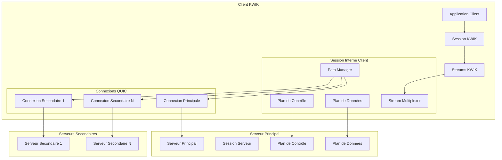

# Design Document - KWIK Transport Protocol

## Overview

KWIK (QUIC With Intelligent Konnections) est un protocole de transport innovant basé sur QUIC-go qui étend les capacités de QUIC en permettant à un client de maintenir simultanément des connexions vers plusieurs serveurs de manière transparente. Le protocole présente une interface identique à QUIC tout en gérant en interne un système complexe d'agrégation de connexions multiples avec des plans de données et de contrôle séparés.

### Objectifs de Conception

- **Transparence** : Interface identique à QUIC pour faciliter la migration
- **Multi-connectivité** : Connexions simultanées vers plusieurs serveurs
- **Performance** : Optimisation des flux logiques et gestion efficace des ressources
- **Fiabilité** : Gestion robuste des pannes et des chemins morts
- **Extensibilité** : Support pour protocoles personnalisés via transmission de paquets bruts

## Architecture

### Vue d'Ensemble de l'Architecture



### Composants Principaux

#### 1. Session KWIK
- **Interface publique** : Compatible QUIC (Dial, Listen, OpenStreamSync, AcceptStream)
- **Implémentation interne** : Agrégat complexe de connexions QUIC multiples
- **Responsabilités** : Gestion transparente des connexions multiples, routage des données

#### 2. Path Manager
- **Gestion des chemins** : Création, maintenance et suppression des chemins
- **Détection de pannes** : Monitoring des chemins et notification des états
- **Optimisation** : Sélection intelligente des chemins pour les opérations

#### 3. Plans de Contrôle et de Données
- **Plan de Contrôle** : Gestion des commandes (addPath, removePath, notifications)
- **Plan de Données** : Transport des données applicatives
- **Isolation** : Séparation stricte entre contrôle et données

## Components and Interfaces

### Structure du Projet

```
kwik/
├── pkg/
│   ├── session/           # Gestion des sessions KWIK
│   │   ├── client.go      # Session cliente
│   │   ├── server.go      # Session serveur
│   │   └── interfaces.go  # Interfaces publiques
│   ├── stream/            # Gestion des flux KWIK
│   │   ├── stream.go      # Implémentation des flux
│   │   ├── multiplexer.go # Multiplexage des flux logiques
│   │   └── manager.go     # Gestion des flux
│   ├── transport/         # Couche transport
│   │   ├── path.go        # Gestion des chemins
│   │   ├── connection.go  # Wrapper des connexions QUIC
│   │   └── manager.go     # Gestionnaire de chemins
│   ├── protocol/          # Définitions du protocole
│   │   ├── frames.go      # Types de trames
│   │   ├── packets.go     # Gestion des paquets
│   │   └── serialization.go # Sérialisation protobuf
│   ├── control/           # Plan de contrôle
│   │   ├── plane.go       # Implémentation du plan de contrôle
│   │   ├── commands.go    # Commandes de contrôle
│   │   └── notifications.go # Notifications
│   └── data/              # Plan de données
│       ├── plane.go       # Implémentation du plan de données
│       ├── aggregator.go  # Agrégation des données
│       └── scheduler.go   # Ordonnancement des envois
├── proto/                 # Définitions protobuf
│   ├── control.proto      # Messages de contrôle
│   ├── data.proto         # Messages de données
│   └── common.proto       # Types communs
├── internal/              # Implémentations internes
│   ├── quic/              # Wrapper QUIC-go
│   ├── utils/             # Utilitaires
│   └── metrics/           # Métriques et monitoring
└── examples/              # Exemples d'utilisation
    ├── client/
    └── server/
```

### Interfaces Publiques

#### Session Interface
```go
type Session interface {
    // Méthodes compatibles QUIC
    OpenStreamSync(ctx context.Context) (Stream, error)
    OpenStream() (Stream, error)
    AcceptStream(ctx context.Context) (Stream, error)
    
    // Méthodes spécifiques serveur (plan de contrôle)
    AddPath(address string) error
    RemovePath(pathID string) error
    GetActivePaths() []PathInfo
    GetDeadPaths() []PathInfo
    GetAllPaths() []PathInfo
    
    // Transmission de paquets bruts
    SendRawData(data []byte, pathID string) error
    
    Close() error
}

type Stream interface {
    // Interface compatible QUIC
    Read([]byte) (int, error)
    Write([]byte) (int, error)
    Close() error
    
    // Métadonnées KWIK
    StreamID() uint64
    PathID() string
}
```

#### Transport Interfaces
```go
type PathManager interface {
    CreatePath(address string) (*Path, error)
    RemovePath(pathID string) error
    GetPath(pathID string) *Path
    GetActivePaths() []*Path
    GetDeadPaths() []*Path
    MarkPathDead(pathID string) error
}

type Path interface {
    ID() string
    Address() string
    IsActive() bool
    IsPrimary() bool
    GetConnection() quic.Connection
    GetControlStream() quic.Stream
    GetDataStreams() []quic.Stream
}
```

## Data Models

### Messages Protobuf

#### Messages de Contrôle
```protobuf
// control.proto
syntax = "proto3";
package kwik.control;

message ControlFrame {
    uint64 frame_id = 1;
    ControlFrameType type = 2;
    bytes payload = 3;
    uint64 timestamp = 4;
}

enum ControlFrameType {
    ADD_PATH_REQUEST = 0;
    ADD_PATH_RESPONSE = 1;
    REMOVE_PATH_REQUEST = 2;
    REMOVE_PATH_RESPONSE = 3;
    PATH_STATUS_NOTIFICATION = 4;
    AUTHENTICATION_REQUEST = 5;
    AUTHENTICATION_RESPONSE = 6;
    STREAM_CREATE_NOTIFICATION = 7;
    RAW_PACKET_TRANSMISSION = 8;
}

message AddPathRequest {
    string target_address = 1;
    string session_id = 2;
}

message AddPathResponse {
    bool success = 1;
    string path_id = 2;
    string error_message = 3;
}

message PathStatusNotification {
    string path_id = 1;
    PathStatus status = 2;
    string reason = 3;
}

enum PathStatus {
    ACTIVE = 0;
    DEAD = 1;
    CONNECTING = 2;
    DISCONNECTING = 3;
}

message AuthenticationRequest {
    string session_id = 1;
    bytes credentials = 2;
}

message StreamCreateNotification {
    uint64 logical_stream_id = 1;
    string path_id = 2;
}

message RawPacketTransmission {
    bytes data = 1;
    string target_path_id = 2;
    string source_server_id = 3;
}
```

#### Messages de Données
```protobuf
// data.proto
syntax = "proto3";
package kwik.data;

message DataFrame {
    uint64 frame_id = 1;
    uint64 logical_stream_id = 2;
    uint64 offset = 3;
    bytes data = 4;
    bool fin = 5;
    uint64 timestamp = 6;
    string path_id = 7;
}

message DataPacket {
    uint64 packet_id = 1;
    string path_id = 2;
    repeated DataFrame frames = 3;
    uint32 checksum = 4;
}

message AckFrame {
    uint64 ack_id = 1;
    repeated uint64 acked_packet_ids = 2;
    string path_id = 3;
    uint64 timestamp = 4;
}
```

#### Types Communs
```protobuf
// common.proto
syntax = "proto3";
package kwik.common;

message PathInfo {
    string path_id = 1;
    string address = 2;
    bool is_primary = 3;
    PathStatus status = 4;
    uint64 created_at = 5;
    uint64 last_active = 6;
}

message SessionInfo {
    string session_id = 1;
    repeated PathInfo paths = 2;
    uint64 created_at = 3;
    bool is_client = 4;
}
```

### Structures de Données Internes

#### Gestion des Offsets
```go
type OffsetManager struct {
    // Offsets KWIK logiques par flux
    logicalOffsets map[uint64]uint64
    
    // Correspondance offsets KWIK -> offsets QUIC par chemin
    offsetMapping map[string]map[uint64]uint64
    
    // Taille maximale des paquets QUIC par chemin
    maxPacketSizes map[string]uint32
}

type PacketSizeCalculator struct {
    quicMaxSize uint32
    kwikHeaderSize uint32
    protobufOverhead uint32
}
```

#### Gestion des Flux
```go
type StreamMultiplexer struct {
    // Flux logiques KWIK
    logicalStreams map[uint64]*LogicalStream
    
    // Flux QUIC réels par chemin
    realStreams map[string][]quic.Stream
    
    // Ratio optimal flux logiques/flux réels
    optimalRatio int // 3-4 flux logiques par flux réel
    
    // Pool de flux réels disponibles
    streamPool map[string]chan quic.Stream
}

type LogicalStream struct {
    id uint64
    pathID string
    realStreamID uint64
    buffer *bytes.Buffer
    offset uint64
    closed bool
}
```

## Error Handling

### Stratégies de Gestion d'Erreurs

#### 1. Pannes de Chemins
```go
type PathFailureHandler struct {
    onPathDead func(pathID string)
    onPathRecovered func(pathID string)
    retryPolicy *RetryPolicy
}

type RetryPolicy struct {
    maxRetries int
    backoffStrategy BackoffStrategy
    timeout time.Duration
}
```

#### 2. Erreurs de Sérialisation
```go
type SerializationErrorHandler struct {
    onMalformedFrame func(frame []byte, err error)
    onDeserializationFailure func(data []byte, err error)
    fallbackStrategy FallbackStrategy
}
```

#### 3. Erreurs de Connexion
```go
type ConnectionErrorHandler struct {
    onConnectionLost func(pathID string, err error)
    onAuthenticationFailure func(pathID string, err error)
    onStreamCreationFailure func(streamID uint64, err error)
}
```

### Codes d'Erreur KWIK
```go
const (
    ErrPathNotFound = "KWIK_PATH_NOT_FOUND"
    ErrPathDead = "KWIK_PATH_DEAD"
    ErrInvalidFrame = "KWIK_INVALID_FRAME"
    ErrAuthenticationFailed = "KWIK_AUTH_FAILED"
    ErrStreamCreationFailed = "KWIK_STREAM_CREATE_FAILED"
    ErrPacketTooLarge = "KWIK_PACKET_TOO_LARGE"
    ErrOffsetMismatch = "KWIK_OFFSET_MISMATCH"
)
```

## Testing Strategy

### Tests Unitaires

#### 1. Tests des Composants Individuels
- **Session** : Tests des méthodes publiques et de l'agrégation
- **PathManager** : Tests de création/suppression de chemins
- **StreamMultiplexer** : Tests du multiplexage et démultiplexage
- **OffsetManager** : Tests de calcul et correspondance des offsets

#### 2. Tests de Sérialisation
- **Protobuf** : Tests de sérialisation/désérialisation de tous les messages
- **Intégrité** : Tests de préservation des données lors des transformations
- **Performance** : Tests de performance de sérialisation

### Tests d'Intégration

#### 1. Tests Multi-Chemins
```go
func TestMultiPathConnectivity(t *testing.T) {
    // Test de connexion simultanée à plusieurs serveurs
    // Vérification de l'agrégation des données
    // Test de basculement en cas de panne
}

func TestPathManagement(t *testing.T) {
    // Test d'ajout/suppression dynamique de chemins
    // Test de notification des changements d'état
    // Test de gestion des chemins morts
}
```

#### 2. Tests de Performance
```go
func BenchmarkStreamMultiplexing(b *testing.B) {
    // Benchmark du multiplexage de flux
    // Mesure de la latence et du débit
    // Test de montée en charge
}

func BenchmarkDataAggregation(b *testing.B) {
    // Benchmark de l'agrégation de données
    // Test avec différents nombres de chemins
    // Mesure de l'overhead du protocole
}
```

### Tests End-to-End

#### 1. Scénarios Réalistes
- **Migration QUIC vers KWIK** : Test de compatibilité
- **Pannes de Serveurs** : Test de résilience
- **Transmission de Paquets Bruts** : Test des protocoles personnalisés

#### 2. Tests de Charge
- **Connexions Simultanées** : Test avec de nombreux clients
- **Flux Multiples** : Test avec de nombreux flux par session
- **Données Volumineuses** : Test de transmission de gros volumes

### Outils de Test

#### 1. Simulateurs
```go
type NetworkSimulator struct {
    latency time.Duration
    packetLoss float64
    bandwidth uint64
}

type ServerSimulator struct {
    servers map[string]*MockServer
    failures map[string]time.Time
}
```

#### 2. Métriques de Test
```go
type TestMetrics struct {
    connectionTime time.Duration
    throughput uint64
    packetLoss float64
    pathSwitchTime time.Duration
    memoryUsage uint64
}
```

## Performance Considerations

### Optimisations Clés

#### 1. Gestion des Flux
- **Pool de Flux** : Réutilisation des flux QUIC réels
- **Ratio Optimal** : 3-4 flux logiques par flux réel
- **Création Lazy** : Création de flux à la demande

#### 2. Gestion des Paquets
- **Calcul de Taille** : Optimisation pour les limites QUIC
- **Batching** : Regroupement de petites trames
- **Compression** : Compression des données répétitives

#### 3. Gestion Mémoire
- **Buffer Pools** : Réutilisation des buffers
- **Garbage Collection** : Nettoyage proactif des ressources
- **Memory Mapping** : Utilisation de mmap pour les gros volumes

### Métriques de Performance

#### 1. Latence
- **Latence de Connexion** : Temps d'établissement des chemins
- **Latence de Données** : Temps de transit des données
- **Latence de Contrôle** : Temps de traitement des commandes

#### 2. Débit
- **Débit Agrégé** : Débit total sur tous les chemins
- **Débit par Chemin** : Performance individuelle des chemins
- **Efficacité** : Ratio débit utile/débit total

#### 3. Utilisation des Ressources
- **CPU** : Utilisation processeur pour le multiplexage
- **Mémoire** : Consommation mémoire des buffers
- **Réseau** : Overhead du protocole KWIK

Cette conception fournit une base solide pour l'implémentation du protocole KWIK, en respectant toutes les exigences définies tout en maintenant la compatibilité avec QUIC et en optimisant les performances pour les connexions multi-serveurs.